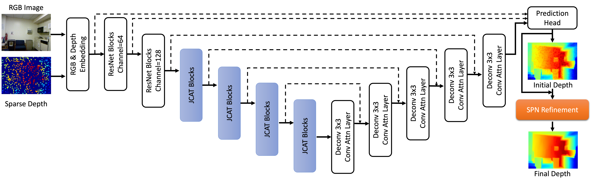

<!-- PROJECT LOGO -->

<p align="center">

  <h1 align="center">CompletionFormer: Depth Completion with Convolutions and Vision Transformers</h1>
  <p align="center">
    <a href="https://youmi-zym.github.io"><strong>Youmin Zhang</strong></a>
    ·
    <a href="https://scholar.google.com.hk/citations?hl=zh-CN&user=jPvOqgYAAAAJ"><strong>Xianda Guo</strong></a>
    ·
    <a href="https://mattpoggi.github.io/"><strong>Matteo Poggi</strong></a>
    <br>
    <a href="http://www.zhengzhu.net/"><strong>Zheng Zhu</strong></a>
    ·
    <a href=""><strong>Guan Huang</strong></a>
    ·
    <a href="http://vision.deis.unibo.it/~smatt/Site/Home.html"><strong>Stefano Mattoccia</strong></a>
  </p>
  <h3 align="center"><a href="">Paper</a> | <a href="https://youmi-zym.github.io/projects/CompletionFormer">Project Page</a></h3>
  <div align="center"></div>
</p>
<p align="center">
  <a href="">
    
  </a>
</p>
<p align="center">
<strong>CompletionFormer</strong>, enabling both local and global propagation for depth completion.
</p>

## ⚙️ Setup

Assuming a fresh [Anaconda](https://www.anaconda.com/download/) distribution, you can install the dependencies with:
```shell
conda create -n completionformer python=3.8
conda activate completionformer
# For CUDA Version == 11.3
pip install torch==1.10.1+cu113 torchvision==0.11.2+cu113 torchaudio==0.10.1+cu113
pip install mmcv-full==1.4.4 mmsegmentation==0.22.1  
pip install timm tqdm thop tensorboardX opencv-python ipdb h5py ipython 
```
We ran our experiments with PyTorch 1.10.1, CUDA 11.3, Python 3.8 and Ubuntu 20.04.

<!-- We recommend using a [conda environment](https://conda.io/docs/user-guide/tasks/manage-environments.html) to avoid dependency conflicts. -->

#### NVIDIA Apex

We used NVIDIA Apex (commit @ 4ef930c1c884fdca5f472ab2ce7cb9b505d26c1a) for multi-GPU training.

Apex can be installed as follows:

```bash
$ cd PATH_TO_INSTALL
$ git clone https://github.com/NVIDIA/apex
$ cd apex
$ git reset --hard 4ef930c1c884fdca5f472ab2ce7cb9b505d26c1a
$ pip install -v --no-cache-dir --global-option="--cpp_ext" --global-option="--cuda_ext" ./ 
```


#### Deformable Convolution V2 (DCNv2)

Build and install DCN module.

```bash
$ cd THIS_PROJECT_ROOT/src/model/deformconv
$ sh make.sh
```

The DCN module in this repository is from [here](https://github.com/xvjiarui/Deformable-Convolution-V2-PyTorch) but some function names are slightly different.

Please refer to the [PyTorch DCN](https://github.com/chengdazhi/Deformable-Convolution-V2-PyTorch) for the original implementation.


## 💾 Datasets
We used two datasets for training and evaluation.

#### NYU Depth V2 (NYUv2)

We used preprocessed NYUv2 HDF5 dataset provided by [Fangchang Ma](https://github.com/fangchangma/sparse-to-dense).

```bash
$ cd PATH_TO_DOWNLOAD
$ wget http://datasets.lids.mit.edu/sparse-to-dense/data/nyudepthv2.tar.gz
$ tar -xvf nyudepthv2.tar.gz
```

After that, you will get a data structure as follows:

```
nyudepthv2
├── train
│    ├── basement_0001a
│    │    ├── 00001.h5
│    │    └── ...
│    ├── basement_0001b
│    │    ├── 00001.h5
│    │    └── ...
│    └── ...
└── val
    └── official
        ├── 00001.h5
        └── ...
```

Note that the original full NYUv2 dataset is available at the [official website](https://cs.nyu.edu/~silberman/datasets/nyu_depth_v2.html).

After preparing the dataset, you should generate a json file containing paths to individual images.

```bash
$ cd THIS_PROJECT_ROOT/utils
$ python generate_json_NYUDepthV2.py --path_root PATH_TO_NYUv2
```

Note that data lists for NYUv2 are borrowed from the [CSPN repository](https://github.com/XinJCheng/CSPN/tree/master/cspn_pytorch/datalist).


#### KITTI Depth Completion (KITTI DC)

KITTI DC dataset is available at the [KITTI DC Website](http://www.cvlibs.net/datasets/kitti/eval_depth.php?benchmark=depth_completion).

For color images, KITTI Raw dataset is also needed, which is available at the [KITTI Raw Website](http://www.cvlibs.net/datasets/kitti/raw_data.php).

The overall data directory is structured as follows:

```
├── kitti_depth
|   ├──data_depth_annotated
|   |  ├── train
|   |  ├── val
|   ├── data_depth_velodyne
|   |  ├── train
|   |  ├── val
|   ├── data_depth_selection
|   |  ├── test_depth_completion_anonymous
|   |  |── test_depth_prediction_anonymous
|   |  ├── val_selection_cropped
|   ├── kitti_raw
|   |   ├── 2011_09_26
|   |   ├── 2011_09_28
|   |   ├── 2011_09_29
|   |   ├── 2011_09_30
|   |   ├── 2011_10_03
```

After preparing the dataset, you should generate a json file containing paths to individual images. 

Especially, we also provide [json file](./data_json/kitti_dc_1e4.json) which lists the randomly selected 10,000 samples for sparsity study.

```bash
$ cd THIS_PROJECT_ROOT/utils

# For Train / Validation
$ python generate_json_KITTI_DC.py --path_root PATH_TO_KITTI_DC

# For Online Evaluation Data
$ python generate_json_KITTI_DC.py --path_root PATH_TO_KITTI_DC --name_out kitti_dc_test.json --test_data
```

## ⏳ Training

Note: batch size is set for each GPU

```bash
$ cd THIS_PROJECT_ROOT/src

# An example command for NYUv2 dataset training
$ python main.py --dir_data PATH_TO_NYUv2 --data_name NYU  --split_json ../data_json/nyu.json \
    --gpus 0 --loss 1.0*L1+1.0*L2 --batch_size 12 --milestones 36 48 56 64 72 --epochs 72 \
    --log_dir ../experiments/ --save NAME_TO_SAVE \
    
# An example command for KITTI DC dataset training: L1 loss
$ python main.py --dir_data PATH_TO_KITTI_DC --data_name KITTIDC --split_json ../data_json/kitti_dc.json \
    --patch_height 240 --patch_width 1216 --gpus 0,1,2,3 --loss 1.0*L1 --lidar_lines 64 \
    --batch_size 3 --max_depth 90.0 --lr 0.001 --epochs 100 --milestones 50 60 70 80 90 100 \
    --top_crop 100 --test_crop --log_dir ../experiments/ --save NAME_TO_SAVE \

# An example command for KITTI DC dataset training: Sparisty Study, e.g., 16 lines
$ python main.py --dir_data PATH_TO_KITTI_DC --data_name KITTIDC --split_json ../data_json/kitti_dc.json \
    --patch_height 240 --patch_width 1216 --gpus 0,1,2,3 --loss 1.0*L1+1.0*L2 --lidar_lines 16 \
    --batch_size 3 --max_depth 90.0 --lr 0.001 --epochs 100 --milestones 50 60 70 80 90 100 \
    --top_crop 100 --test_crop --log_dir ../experiments/ --save NAME_TO_SAVE \

# An example command for KITTI DC dataset training: L1 + L2 loss
$ python main.py --dir_data PATH_TO_KITTI_DC --data_name KITTIDC --split_json ../data_json/kitti_dc.json \
    --patch_height 240 --patch_width 1216 --gpus 0,1,2,3 --loss 1.0*L1+1.0*L2 --lidar_lines 64 \
    --batch_size 3 --max_depth 90.0 --lr 0.001 --epochs 250 --milestones 150 180 210 240 \
    --top_crop 100 --test_crop --log_dir ../experiments/ --save NAME_TO_SAVE \
```

Please refer to the config.py for more options. 

**For KITTI training, we emperically find the better results if more training time and GPUs are given**. 

During the training, tensorboard logs are saved under the experiments directory. To run the tensorboard:

```bash
$ cd THIS_PROJECT_ROOT/experiments/
$ tensorboard --logdir=. --bind_all --port 6006
```

Then you can access the tensorboard via http://YOUR_SERVER_IP:6006

## 📊 Testing

```bash
$ cd THIS_PROJECT_ROOT/src

# An example command for NYUv2 dataset testing
$ python main.py --dir_data PATH_TO_NYUv2 --data_name NYU  --split_json ../data_json/nyu.json \
    --gpus 0 --max_depth 10.0 --num_sample 500 \
    --test_only --pretrain PATH_TO_WEIGHTS --save NAME_TO_SAVE

# An example command for KITTI DC dataset testing
$ python main.py --dir_data PATH_TO_KITTI_DC --data_name KITTIDC --split_json ../data_json/kitti_dc.json \
    --patch_height 240 --patch_width 1216 --gpus 0 --max_depth 90.0 \
    --test_only --pretrain PATH_TO_WEIGHTS --save NAME_TO_SAVE
```

**Pretrained Checkpoints**: NYU, KITTI_DC (comming soon!)

To generate KITTI DC Online evaluation data:

```bash
$ cd THIS_PROJECT_ROOT/src
$ python main.py --dir_data PATH_TO_KITTI_DC --data_name KITTIDC --split_json ../data_json/kitti_dc_test.json \
    --patch_height 240 --patch_width 1216 --gpus 0 --max_depth 90.0 \
    --test_only --pretrain PATH_TO_WEIGHTS --save_image --save_result_only --save NAME_TO_SAVE
```

Images for submission can be found in THIS_PROJECT_ROOT/experiments/NAME_TO_SAVE/test/epoch%04d.


## 👩‍⚖️ Acknowledgement

Thanks the authors for their works:

[NLSPN](https://github.com/zzangjinsun/NLSPN_ECCV20), [MPViT](https://github.com/youngwanLEE/MPViT), [PVT](https://github.com/whai362/PVT), [Monodepth2](https://github.com/nianticlabs/monodepth2)


## Citation

If you find our work useful in your research please consider citing our paper:

```
@inproceedings{Zhang2023CompletionFormer,
      title     = {CompletionFormer: Depth Completion with Convolutions and Vision Transformers},
      author    = {Zhang, Youmin and Guo, Xianda and Poggi, Matteo and Zhu, Zheng and Huang, Guan and Mattoccia, Stefano},
      booktitle = {CVPR},
      year      = {2023}
  }
```

